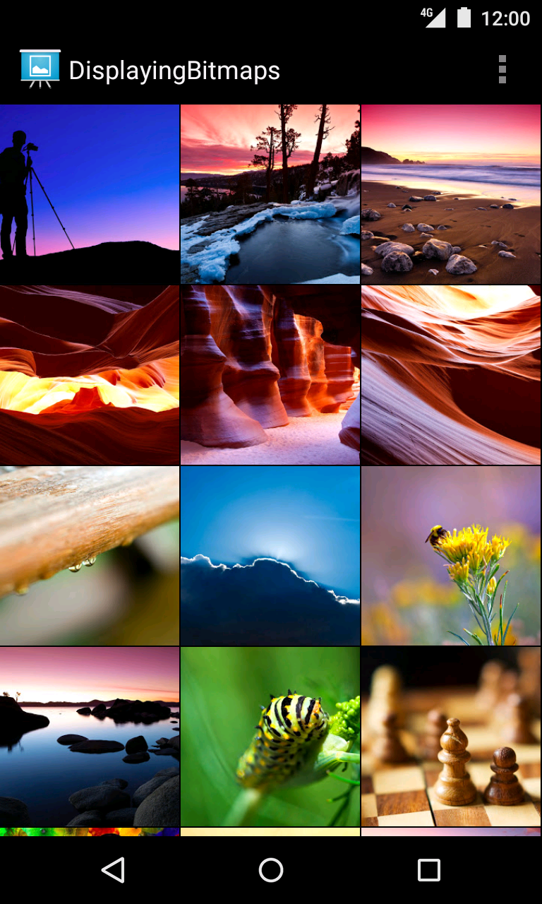

Android DisplayingBitmaps Sample
===================================

Sample demonstrating how to load large bitmaps efficiently off the main UI thread,
caching bitmaps (both in memory and on disk), managing bitmap memory and displaying
bitmaps in UI elements such as ViewPager and ListView/GridView.

Introduction
------------

This is a sample application for the Android Training class [Displaying Bitmaps Efficiently][1].

It demonstrates how to load large bitmaps efficiently off the main UI thread, caching
bitmaps (both in memory and on disk), managing bitmap memory and displaying bitmaps
in UI elements such as ViewPager and ListView/GridView.

[1]: http://developer.android.com/training/displaying-bitmaps/

Pre-requisites
--------------

- Android SDK 28
- Android Build Tools v28.0.3
- Android Support Repository

Screenshots
-------------

  

Getting Started
---------------

This sample uses the Gradle build system. To build this project, use the
"gradlew build" command or use "Import Project" in Android Studio.

Support
-------

- Stack Overflow: http://stackoverflow.com/questions/tagged/android

If you've found an error in this sample, please file an issue:
https://github.com/android/graphics

Patches are encouraged, and may be submitted by forking this project and
submitting a pull request through GitHub. Please see CONTRIBUTING.md for more details.
