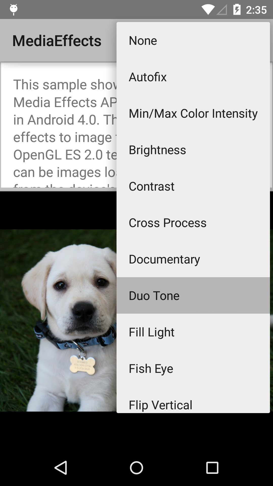
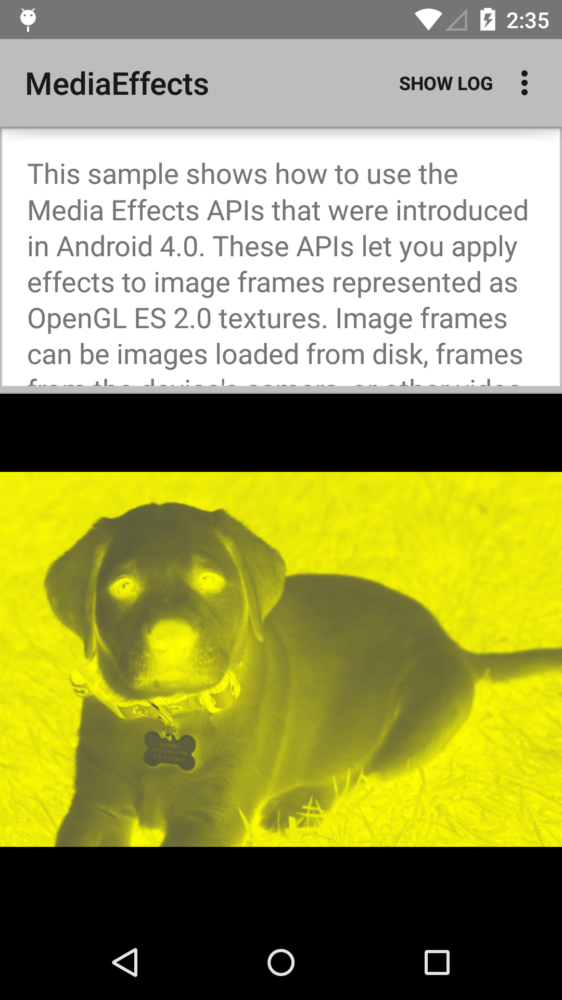

Android MediaEffects Sample
===================================

This sample shows how to use the Media Effects APIs that were
introduced in Android 4.0.

Introduction
------------

The [Media Effects APIs][1] lets you apply effects to image frames
represented as OpenGL ES 2.0 textures.  Image frames can be images
loaded from disk, frames from the device's camera, or other video
streams.

For a list of available effects, refer to [EffectsFactory][2].

[1]: http://developer.android.com/reference/android/media/effect/package-summary.html
[2]: http://developer.android.com/reference/android/media/effect/EffectFactory.html

Pre-requisites
--------------

- Android SDK 28
- Android Build Tools v28.0.3
- Android Support Repository

Screenshots
-------------

  

Getting Started
---------------

This sample uses the Gradle build system. To build this project, use the
"gradlew build" command or use "Import Project" in Android Studio.

Support
-------

- Stack Overflow: http://stackoverflow.com/questions/tagged/android

If you've found an error in this sample, please file an issue:
https://github.com/android/graphics

Patches are encouraged, and may be submitted by forking this project and
submitting a pull request through GitHub. Please see CONTRIBUTING.md for more details.
